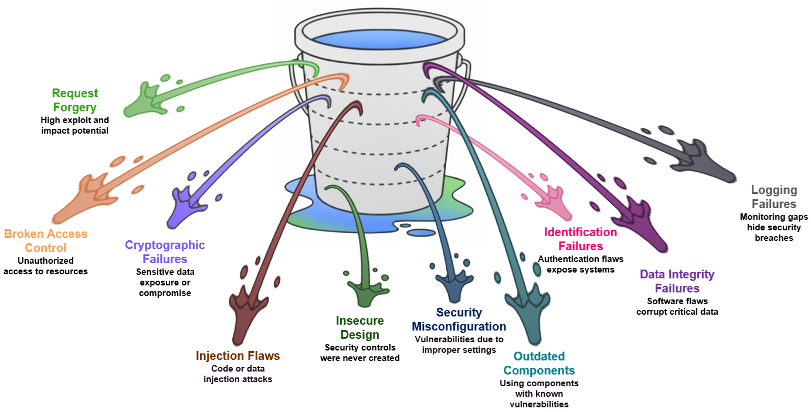

# Mastering Secure Application Development in SAP BTP : A Practical Workshop

## Description

This repository contains the material for the **Mastering Secure Application Development in SAP BTP: A Practical Workshop** session.  

## Overview

Welcome to this hands-on workshop dedicated to embedding security into your SAP BTP applications. 
In an era where data breaches and cyber threats are constant, building secure software is not an option—it's a requirement. This lab is designed for developers working with the SAP Cloud Application Programming Model (CAP) and Node.js. 

By completing the exercises, you will gain the practical skills to identify and mitigate common security risks as defined by the [OWASP Top 10 vulnerabilities](https://owasp.org/Top10/). 

### 🎯 Learning Objectives

-	**Identify and Mitigate** a critical OWASP Top 10 vulnerability in a real-world scenario.
-	**Leverage**  the SAP Cloud Application Programming Model (CAP) for secure, cloud-native development.
-	**Implement** BTP's comprehensive, built-in security services to protect your data and business logic.
-	**Validate** the effectiveness of security fixes through practical testing.

  
   
  <em>Top 10 OWASP Vulnerabilities</em>

## Requirements (TBD)

The requirements to follow the exercises in this repository are active trial accounts for SAP BTP and for the SAP Cloud Identity Services. 

**First you have to get your SAP BTP trial account. Follow these instructions and choose the region "US East (VA)":** 
[Get a Free Account on SAP BTP Trial](https://developers.sap.com/tutorials/hcp-create-trial-account.html)

**Then activate your SAP Cloud Identity Services trial. Follow the instructions in this blog:** 
[SAP Cloud Identity Services offered as Trial Version](https://blogs.sap.com/2023/04/13/sap-cloud-identity-services-offered-as-trial-version/)
💡Ensure that you choose the default domain "ondemand.com", as "cloud.sap" is currently not supported on the trial landscape.

💡You should have access to your mailbox, which you used while registering for your BTP trial account in order to activate your SAP Cloud Identity Services trial account.

**Finally, install a Time-based One-Time-Password (TOTP) authentication application (such as Google Authenticator or Microsoft Authenticator) on your mobile device and familiarize yourself with the process to create accounts in the app.**

Now you are ready to start the exercises.

💡In some of the exercises you will be asked to switch from one user to another. This works more reliable if you use the Incognito mode of your browser. Without the Incognito mode, you may run into situations where you are authenticated automatically with the wrong user.

## Exercises
Every exercise module is a self-contained lab focused on a specific vulnerability. All modules adhere to the following standard structure:

- 📖 **Overview:** A high-level description of the vulnerability, its impact, and why it's a security risk.
- 🚨 **Vulnerable Code:** A snippet of code containing the specific security flaw. We'll analyze why it's insecure.
- 💥 **Exploitation:** A step-by-step guide on how to exploit the vulnerability, demonstrating its real-world impact.
- 🛡️ **Remediation:** The corrected version of the code that patches the vulnerability, along with an explanation of the fix.
- ✅ **Verification:** A simple procedure to confirm that the patch has successfully mitigated the vulnerability and the exploit no longer works.
- 📌 **Summary:** A practical recap that consolidates the exercise outcomes with actionable takeaways.

This structure is designed to help you understand a vulnerability from an attacker's perspective and a defender's, see how it can impact a CAP application, and learn actionable steps to mitigate it with BTP best practices. 

- [Getting Started](exercises/ex0/)
- [Exercise 1 - Broken Access Control](exercises/ex1/)
    - [Exercise 1.1 - Enter the application with your trial identity provider user](exercises/ex1#exercise-11---Setup-SAP-Build-Apps-and-enter-the-application-with-your-trial-identity-provider-user)
    - [Exercise 1.2 - Horizontal Privilege Escalation](exercises/ex1/ex1.1/README.md)
    - [Exercise 1.3 - Vertical Privilege Escalation](exercises/ex1/ex1.2/README.md)
    - [Exercise 1.4 - Insecure Direct Object References (IDOR)](exercises/ex1/ex1.3/README.md)
    
- [Exercise 2 - Security Recommendations regarding user access and authentication](exercises/ex2/)
    - [Exercise 2.1 - Manage obsolete administrators](exercises/ex2#exercise-21-identify-obsolete-users)
    - [Exercise 2.2 - Defining a custom password policy](exercises/ex2#exercise-22-defining-a-custom-password-policy)
    - [Exercise 2.3 - Keep public access to applications by self-registration disabled](exercises/ex2#exercise-23-keep-public-access-to-applications-by-self-registration-disabled)
    - [Exercise 2.4 - Keep Social Sign-On disabled](exercises/ex2#exercise-24-keep-social-sign-on-disabled)
- [Exercise 3 - Security Recommendations regarding the Audit Log](exercises/ex3/)
    - [Exercise 3.1 - Subscribe to the SAP Audit Log Viewer service](exercises/ex3#exercise-31-subscribe-to-the-sap-audit-log-viewer-service)
    - [Exercise 3.2 - Configure the SAP Audit Log Viewer service](exercises/ex3#exercise-32-configure-the-sap-audit-log-viewer-service)
    - [Exercise 3.3 - Check the audit logs and download audit log entries via the SAP Audit Log Viewer service](exercises/ex3#exercise-33-check-the-audit-logs-and-download-audit-log-entries-via-the-sap-audit-log-viewer-service)
- [Exercise 4 - Managing administrative authorizations in SAP Cloud Identity Services (optional)](exercises/ex4/)
    - [Exercise 4.1 - Enable policy-based authorizations in SAP Cloud Identity Services](exercises/ex4/README.md#exercise-41-enable-policy-based-authorizations-in-sap-cloud-identity-services)
    - [Exercise 4.2 - Create an authorization policy for reading users](exercises/ex4/README.md#exercise-42-create-an-authorization-policy-for-reading-users)
    - [Exercise 4.3 - Create another user account to be used for testing](exercises/ex4/README.md#exercise-43-create-another-user-account-to-be-used-for-testing)
    - [Exercise 4.4 - Remove classic authorization for reading users](exercises/ex4/README.md#exercise-44-remove-classic-authorization-for-reading-users)
    - [Exercise 4.5 - Validate that you can still see all user records](exercises/ex4/README.md#exercise-45-validate-that-you-can-still-see-all-user-records)
    - [Exercise 4.6 - Restrict the authorization policy](exercises/ex4/README.md#exercise-46-restrict-the-authorization-policy)
    - [Exercise 4.7 - Validate that you can only see the allowed user accounts](exercises/ex4/README.md#exercise-47-validate-that-you-can-only-see-the-allowed-user-accounts)

**IMPORTANT**

Your repo must contain the .reuse and LICENSES folder and the License section below. DO NOT REMOVE the section or folders/files. Also, remove all unused template assets (images, folders, etc) from the exercises folder. 

## Contributing
Please read the [CONTRIBUTING.md](./CONTRIBUTING.md) to understand the contribution guidelines.

## Code of Conduct
Please read the [SAP Open-Source Code of Conduct](https://github.com/SAP-samples/.github/blob/main/CODE_OF_CONDUCT.md).

## How to obtain support

Support for the content in this repository is available during the actual time of the online session for which this content has been designed. Otherwise, you may request support via the [Issues](../../issues) tab.

## License
Copyright (c) 2025 SAP SE or an SAP affiliate company. All rights reserved. This project is licensed under the Apache Software License, version 2.0 except as noted otherwise in the [LICENSE](LICENSES/Apache-2.0.txt) file.
